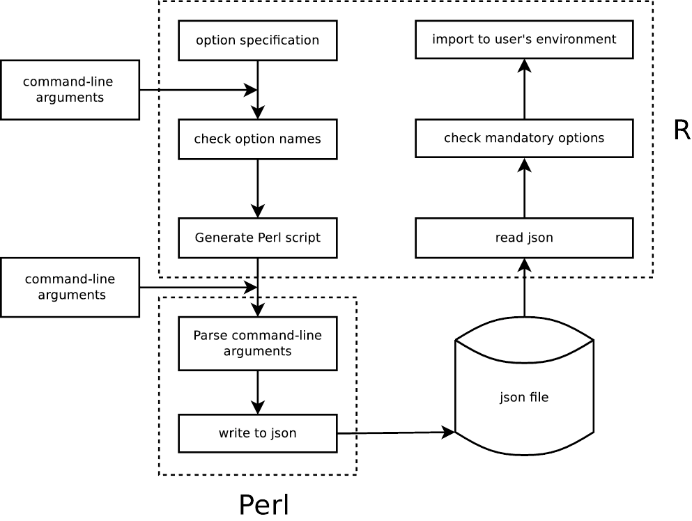

---------------------------------------------------------------------

```{r, echo = FALSE, message = FALSE}
library(knitr)
knitr::opts_chunk$set(
    error = FALSE,
    tidy  = FALSE,
    message = FALSE,
    comment = NA,
    fig.align = "center")
library(GetoptLong)
```

There are already several R packages which parse command-line arguments such
as [**getopt**](https://CRAN.R-project.org/package=getopt),
[**optparse**](https://CRAN.R-project.org/package=optparse),
[**argparse**](https://CRAN.R-project.org/package=argparse),
[**docopt**](https://CRAN.R-project.org/package=docopt). Here
**GetoptLong** is another command-line argument parser (actually it was
developed very early, [the first CRAN
version](https://cran.r-project.org/src/contrib/Archive/GetoptLong/) was in
2013) which wraps the powerful Perl module
[`Getopt::Long`](https://metacpan.org/pod/Getopt::Long). **GetoptLong**
package also provides some adaptations for easier use in R.

Using **GetoptLong** is simple especially for users having Perl experience (Oops, age
exposed :)) because the specification is almost the same as in Perl. The
original website of
[`Getopt::Long`](https://metacpan.org/pod/Getopt::Long) is always
your best reference.

**Note: to use this package, Perl should be installed.**

## Workflow of the wrapping

The **GetoptLong** R package automatically generates a Perl script according
to the specifications in the R script. Later the Perl script is executed with
the command-line arguments that user specified. The options are parsed and saved
into a json file. Finally R reads back the json file and formats them as R
variables.

Following figure shows how the R package works for parsing the command-line
arguments.

```{r, echo = FALSE, out.width = "600px"}

```

## A quick example

### Specify as a vector

The following example gives you some feels of using **GetoptLong** package. The following
code is saved in to an R script named `foo.R`.

```{r simple, eval = FALSE}
library(GetoptLong)

cutoff = 0.05
GetoptLong(
    "number=i", "Number of items.",
    "cutoff=f", "Cutoff for filtering results.",
    "verbose",  "Print message."
)
```

The R script can be executed as:

```
~\> Rscript foo.R --number 4 --cutoff 0.01 --verbose
~\> Rscript foo.R --number=4 --cutoff=0.01 --verbose
~\> Rscript foo.R -n 4 -c 0.01 -v
~\> Rscript foo.R -n 4 --verbose
```

In this example, `number` is a mandatory option and it should only be in
integer mode. `cutoff` is optional and it already has a default value 0.05.
`verbose` is a logical option. If parsing is successful, two variables
`number` and `verbose` will be imported into the working environment with
the specified values. Value for `cutoff` will be updated if it is specified in
command-line.

Data types are automatically checked. _E.g._, if `cutoff` is specified with a character,
an error will be thrown.

The option usage triggered by `--help` is automatically generated. There are
two styles:

The one-column style:

```{r, echo = FALSE}
chunks <- knitr:::knit_code$get()
GetoptLong.options("__argv_str__" = "--help")
local({ eval(parse(text = chunks[["simple"]])) })
GetoptLong.options("__argv_str__" = NULL)
```

Or the two-column style:

```{r, echo = FALSE}
chunks <- knitr:::knit_code$get()
GetoptLong.options("__argv_str__" = "--help")
GetoptLong.options("help_style" = "two-column")
local({ eval(parse(text = chunks[["simple"]])) })
GetoptLong.options("__argv_str__" = NULL)
GetoptLong.options("help_style" = "one-column")
```

You can find the short option names (in single letters) are automatically added.
The information of default values is added as well.

### Specify as a template

The specification can also be set as a template where the specifications are marked
by `<>`.

```{r template, eval = FALSE}
spec = "
This is an example of using template to specify options.

Usage: Rscript foo.R [options]

Options:
  <number=i> Number of items.
  <cutoff=f> Cutoff for filtering results.               
  <verbose> Print messages.

Contact: name@address
"

GetoptLong(spec, template_control = list(opt_width = 21))
```

The parameter `opt_width` controls the maximal width of the option description
(_i.e._, `--number, -n integer`, `--cutoff, -c numeric` and `--verbose`).

Calling `Rscript foo.R --help` generates the following message:

```{r, echo = FALSE}
chunks <- knitr:::knit_code$get()
GetoptLong.options("__argv_str__" = "--help")
local({ eval(parse(text = chunks[["template"]])) })
GetoptLong.options("__argv_str__" = NULL)
```

## Advantages

There are several advantages compared to other command-line argument parser
packages. The major advantage comes from the `Getopt::Long` Perl module which
actually parses the options. The `Getopt::Long` module provides a flexible,
smart and compact way for specifying command-line arguments. The major
features are:

1. Various formats of specifying options with values, such as

```
-s 24 -s24
```

or 

```
--size 24  --size=24 -size 24  -size=24
```

2. Single-letter options can be bundled:

```
-a -b -c  -abs
```

3. Options with multiple names. With the following specification, `--length`,
   `--height` are the same.

```
length|height=f
```

4. Automatically support single-letter options. If the first letter of an
   option is unique to all other options, the first letter can be used as an
   optional option name. For example, if `l` and `h` are unique, `--length`,
   `--height`, `-l` and `-h` set the same option.

```
length|height=f  --length --height -l -h
```

5. Rich option data types, including scalar, vector (array in Perl), list (hash
   in Perl). For example:

```
length=i     a single integer scalar
name=s       a single character scalar
```

can be specified as:

```
--length 1 --name a
```

or

```
length=i@       a integer vector
name=s@         a character vector
length=i{2,}    a integer vector, at least two elements
name=s{2,}      a character vector, at least two elements
```
can be specified as:

```
--length 1 2 3 --name a b c
```

or

```
length=i%    name-value pair, values should be integers
name=s%      name-value pair, values should be characters
```

to be specified as:


```
--length foo=1 bar=3 --name foo=a bar=b
```

The features from R part are:

1. It automaticlly generates option usage in two styles. The data type and
   default value of options are automatically detected and included.

2. It supports specifying the usage in a template which allows more complex
   text of option usage.

3. It allows grouping options.

3. It provides a natural and convenient way to specify defaults.

## Customize the specifications

Each specifier in options consists of two parts: the name specification and
the argument specification:

```
length|size|l=i@
```

Here `length|size|l` is a list of alternative names separated by `|`. The
remaining part is argument specification which defines the mode and amount of
arguments.

Specify any of alternative option name from command-line is ok and it
doesn't matter whether using one or two slash in front of the option name.
Sometimes you even don't need to specify complete option names, you only need
to make sure the partial name match is unique. If the partial match is not
uniqe, it will throw an error. For above example, we can specify the argument
like:

```
~\> Rscript foo.R --length 1
~\> Rscript foo.R --length=1 # adding "=" is also ok
~\> Rscript foo.R -len 1
~\> Rscript foo.R -lengt 1 # this is also ok, but not suggested
~\> Rscript foo.R --size 1
~\> Rscript foo.R -l 1
```

Options for argument specification are:

- no argument specification: taking no argument. Options are logical.
- `!`: taking no argument. Options are logical. You can set its oposite value
  by adding it with `no` or `no-`. _E.g._, `foo!` allows `--foo` as well as
  `--nofoo` and `--no-foo`.
- `=type[desttype][repeat]`: options should have arguments (or options should
  have values specified). _E.g._ `tag=i@` where `i` corresponds to `type`,
  and `@` corresponds to `desttype`, or `tag=i{2,}` where `{2,}` corresponds to `repeat`.

Please note `:[type][desttype]` is not supported here. We use another way to
define mandatory options and optional options. If you don't know what it is,
just ignore this paragraph.

Available `type` options are:

- `s`: strings
- `i`: integers
- `F`: real numbers
- `o`: extended integer, an octal string (`0` followed
by `0`, `1` .. `7`), or a hexadecimal string (`0x` followed by
`0` .. `9`, `A` .. `F`, case insensitive), or a binary string
(`0b` followed by a series of `0` and `1`).

Available `desttype` settings are:

- `@`: array, allow more than one arguments for an option.
- `%`: hash, allow arguments like `name=value`.
- nothing: scalar, single argument for single option.


Available `repeat` settings are formatted as `{\d,\d}`. Note there is no space
character inside:

- `{2}`: exactly 2 arguments for an option.
- `{2,}`: at least 2 arguments for an option.
- `{,4}`: at most 4 arguments for an option.
- `{2,5}`: minimal 2 and maximal 5 arguments for an option.

Note `desttype` and `repeat` cannot be used at the same time.

In the Perl module, `tag=i@` only allows, _e.g._, specification of `--tag 1
--tag 2` while `--tag 1 2` is not allowed which is only possible by
`tag=i{1,}`. In the R package, we made some adjustment and allow `tag=i@` to
also accept `-tag 1 2`. Similarly, `tag=i%` only allows `--tag name1=value1
--tag name2=value2` in the Perl module. In the R package, it also allows
`--tag name1=value1 name2=value2`.

Following table contains examples for each type of option specification:

<style>
#tb th {
	text-align: left;
	background-color: #C0FFC0;
}
#tb th, #tb td {
    padding: 2px 4px;
}
#tb tr._odd td {
	background-color: #E0FFE0;
}
#tb tr._even td {
	background-color: #FFFFE0;
}
#tb td._first {
	vertical-align: text-top;
}
</style>

<table id='tb'>
<tr><th>Options</th><th>Command-line arguments</th><th>Value of `tag`</th></tr>

<tr class = "_odd"><td rowspan=8 class="_first"><code>tag=i</code></td><td><code>--tag 1</code></td><td><code>1</code></td></tr>
<tr class = "_odd"><td><code>--tag=1</code></td><td><code>1</code></td></tr>
<tr class = "_odd"><td><code>-t 1</code></td><td><code>1</code></td></tr>
<tr class = "_odd"><td><code>--tag 1 --tag 2</code></td><td><code>2</code>. Here only take the last one</td></tr>
<tr class = "_odd"><td><code>--tag 0.1</code></td><td>Error: Value "0.1" invalid for option tag (number expected)</td></tr>
<tr class = "_odd"><td><code>--tag a</code></td><td>Error: Value "a" invalid for option tag (number expected)</td></tr>
<tr class = "_odd"><td><code>--tag</code></td><td>Error: Option tag requires an argument</td></tr>
<tr class = "_odd"><td>no argument</td><td>tag is mandatory, please specify it</td></tr>
<tr class = "_even"><td rowspan=3 class="_first"><code>tag=s</code></td><td><code>--tag 1</code></td><td><code>"1"</code>. Here double quote is used because it is specified as a string.</td></tr>
<tr class = "_even"><td><code>--tag 0.1</code></td><td><code>"0.1"</code></td></tr>
<tr class = "_even"><td><code>--tag a</code></td><td><code>"a"</code></td></tr>
<tr class = "_odd"><td rowspan=3 class="_first"><code>tag=f</code></td><td><code>--tag 1</code></td><td><code>1</code></td></tr>
<tr class = "_odd"><td><code>--tag 0.1</code></td><td><code>0.1</code></td></tr>
<tr class = "_odd"><td><code>--tag a</code></td><td>Error: Value "a" invalid for option tag (real number expected)</td></tr>
<tr class = "_even"><td rowspan=6 class="_first"><code>tag=o</code></td><td><code>--tag 1</code></td><td><code>1</code></td></tr>
<tr class = "_even"><td><code>--tag 0b001001</code></td><td><code>9</code></td></tr>
<tr class = "_even"><td><code>--tag 0721</code></td><td><code>465</code></td></tr>
<tr class = "_even"><td><code>--tag 0xaf2</code></td><td><code>2802</code></td></tr>
<tr class = "_even"><td><code>-tag 0.1</code></td><td>Error: Value "0.1" invalid for option tag (extended number expected)</td></tr>
<tr class = "_even"><td><code>--tag a</code></td><td>Error: Value "a" invalid for option tag (extended number expected)</td></tr>
<tr class = "_odd"><td rowspan=6 class="_first"><code>tag</code></td><td><code>--tag 1</code></td><td><code>TRUE</code></td></tr>
<tr class = "_odd"><td><code>--tag 0</code></td><td><code>TRUE</code>, it doesn't care the value for the option.</td></tr>
<tr class = "_odd"><td><code>--tag 0.1</code></td><td><code>TRUE</code></td></tr>
<tr class = "_odd"><td><code>--tag a</code></td><td><code>TRUE</code></td></tr>
<tr class = "_odd"><td><code>--tag</code></td><td><code>TRUE</code></td></tr>
<tr class = "_odd"><td>no argument</td><td><code>FALSE</code></td></tr>
<tr class = "_even"><td rowspan=2 class="_first"><code>tag!</code></td><td><code>--tag</code></td><td><code>TRUE</code></td></tr>
<tr class = "_even"><td><code>--no-tag</code></td><td><code>FALSE</code></td></tr>
<tr class = "_odd"><td rowspan=4 class="_first"><code>tag=i@</code></td><td><code>--tag 1</code></td><td><code>1</code></td></tr>
<tr class = "_odd"><td><code>--tag 1 2</code></td><td><code>c(1, 2)</code></td></tr>
<tr class = "_odd"><td><code>--tag 1 --tag 2</code></td><td><code>c(1, 2)</code></td></tr>
<tr class = "_odd"><td><code>--tag=1 --tag=2</code></td><td><code>c(1, 2)</code></td></tr>
<tr class = "_even"><td rowspan=3 class="_first"><code>tag=i%</code></td><td><code>--tag 1</code></td><td>Error: Option tag, key "1", requires a value</td></tr>
<tr class = "_even"><td><code>--tag foo=1 --tag bar=2</code></td><td><code>list(foo = 1, bar = 2)</code>, <code>tag</code> is a list.</td></tr>
<tr class = "_even"><td><code>--tag foo=1 bar=2</code></td><td><code>list(foo = 1, bar = 2)</code>, <code>tag</code> is a list.</td></tr>
<tr class = "_odd"><td rowspan=3 class="_first"><code>tag=i{2}</code></td><td><code>--tag 1</code></td><td>Error: Insufficient arguments for option tag</td></tr>
<tr class = "_odd"><td><code>--tag 1 2</code></td><td><code>c(1, 2)</code></td></tr>
<tr class = "_odd"><td><code>--tag 1 --tag 2</code></td><td>Error: Value "--tag" invalid for option tag</td></tr>
<tr class = "_even"><td rowspan=3 class="_first"><code>tag=i{2,}</code></td><td><code>--tag 1</code></td><td>Error: Insufficient arguments for option tag</td></tr>
<tr class = "_even"><td><code>--tag 1 2</code></td><td><code>c(1, 2)</code></td></tr>
<tr class = "_even"><td><code>--tag 1 2 3</code></td><td><code>c(1, 2, 3)</code></td></tr>
<tr class = "_odd"><td rowspan=3 class="_first"><code>tag=i{,2}</code></td><td><code>--tag 1</code></td><td><code>1</code></td></tr>
<tr class = "_odd"><td><code>--tag 1 2</code></td><td><code>c(1, 2)</code></td></tr>
<tr class = "_odd"><td><code>--tag 1 2 3</code></td><td><code>c(1, 2)</code></td></tr>
</table>

## Where do the option values go

Options will be imported into user's environment as R variables by default.
The first option name in all alternative names will be taken as the name of
the variable, (_e.g._ for specification of `length|size=s`, `length` will be
used as the variable name.), which means, it must be a valid R variable name.
Any definition of these variables in front of `GetoptLong()` will be treated
as default values for the corresponding options. **If options already have
default values, they are optional in command-line**. If the variable is defined
as a function before `GetoptLong()` is called, it is treated as undefined.
Please note your option names should not start with the dot. Although it is
valid for R variables but it is not allowed for **Getopt::Long** module.

For the following example:

```{r print_var, eval = FALSE}
library(GetoptLong)

cutoff = 0.05
GetoptLong(
    "number=i{1,}", "Number of items.",
    "cutoff=f", "Cutoff for filtering results.",
    "param=s%", "Parameters specified by name=value pairs.",
    "verbose",  "Print message."
)

print(number)
print(cutoff)
print(param)
print(verbose)
```

a calling from command-line:

```
Rscript foo.R --number 1 2 --param var1=a var2=b --verbose
```

will print

```{r, echo = FALSE}
chunks <- knitr:::knit_code$get()
GetoptLong.options("__argv_str__" = "--number 1 2 --param var1=a var2=b --verbose")
local({ eval(parse(text = chunks[["print_var"]])) })
GetoptLong.options("__argv_str__" = NULL)
```

There are two ways to specify logical options, _e.g._, `verbose` and `verbose!`. 
`verbose` always takes `FALSE` as default and you cannot set default value for it,
while you can set default for `verbose!`. _E.g._:

```{r, eval = FALSE}
verbose = TRUE
GetoptLong(
    "verbose!",  "Print message."
)
```

If `--verbose`/`--no-verbose` is not specified, the variable `verbose` is
`TRUE`. If `--verbose` is specified, `verbose` is `TRUE` and if `--no-verbose`
is specified, `verbose` is `FALSE`.


If you don't want to directly export options as variables, you can assign
`envir` argument with an environment variable so that all the option values
go there.

```{r with_env, eval = FALSE}
opt = new.env()

opt$cutoff = 0.05
GetoptLong(
    "number=i@", "Number of items.",
    "cutoff=f", "Cutoff for filtering results.",
    "param=s%", "Parameters specified by name=value pairs.",
    "verbose",  "Print message.",

    envir = opt
)
print(as.list(opt))
```

a calling from command-line:

```
Rscript foo.R --number 1 2 --param var1=a var2=b --verbose
```

will print

```{r, echo = FALSE}
chunks <- knitr:::knit_code$get()
GetoptLong.options("__argv_str__" = "--number 1 2 --param var1=a var2=b --verbose")
local({ eval(parse(text = chunks[["with_env"]])) })
GetoptLong.options("__argv_str__" = NULL)
```

## Help option

`help` is a reserved option, which means, you can not use it as yours.

Option usage is automatically generated and can be retrieved by setting
`--help` in the command. In following example, I create an option
specification that contains all types of options (with long descriptions):

```{r complex_example, eval = FALSE}
GetoptLong(
    "count=i",  paste("This is a count. This is a count. This is a count.",
                      "This is a count.  This is a count. This is a count."),
    "number=f", paste("This is a number. This is a number. This is a number.",
                      "This is a number. This is a number. This is a number."),
    "array=f@", paste("This is an array. This is an array. This is an array.",
                      "This is an array. This is an array. This is an array."),
    "hash=s%",  paste("This is a hash. This is a hash. This is a hash.",
                      "This is a hash. This is a hash. This is a hash."),
    "verbose!", "Whether show messages",
    "flag",     "a non-sense option"
)
```

The option usage is as follows. Here, for example, the single-letter option
`-c` for `--count` is automatically extracted while not for `--help` because `h`
matches two options.

```{r, echo = FALSE}
chunks <- knitr:::knit_code$get()
GetoptLong.options("__argv_str__" = "--help")
local({ eval(parse(text = chunks[["complex_example"]])) })
GetoptLong.options("__argv_str__" = NULL)
```

If default values for options are provided, they are properly inserted to the
usage message.

```r
count = 1
number = 0.1
array = c(1, 2)
hash = list("foo" = "a", "bar" = "b")
verbose = TRUE
GetoptLong(
  ...
)
```


```{r, echo = FALSE}
chunks <- knitr:::knit_code$get()
GetoptLong.options("__argv_str__" = "--help")
local({ count = 1
    number = 0.1
    array = c(1, 2)
    hash = list("foo" = "a", "bar" = "b")
    verbose = TRUE
    eval(parse(text = chunks[["complex_example"]])) 
})
GetoptLong.options("__argv_str__" = NULL)
```


The global parameters `help_style` can be set to `two-column` to change
to another style:

```{r, eval = FALSE}
GetoptLong.options(help_style = "two-column")
# specifying the defaults
GetoptLong{
    ...
}
```


```{r, echo = FALSE}
chunks <- knitr:::knit_code$get()
GetoptLong.options("__argv_str__" = "--help")
GetoptLong.options("help_style" = "two-column")
local({ count = 1
    number = 0.1
    array = c(1, 2)
    hash = list("foo" = "a", "bar" = "b")
    verbose = TRUE
    eval(parse(text = chunks[["complex_example"]])) 
})
GetoptLong.options("__argv_str__" = NULL)
GetoptLong.options("help_style" = "one-column")
```

When options are specified as name-value pairs, these sub options can be documented as
follows. Note the specifications of _e.g._ `foo$name1` are only for the usage message.

```{r sub_opt, eval = FALSE}
foo = list(a = 1, b = 2)
GetoptLong(
    "foo=i%", paste("This is foo. This is foo. This is foo. This is foo.",
                    "This is foo. This is foo. This is foo. This is foo."),
    "foo$name1", paste("name1 in foo. name1 in foo. name1 in foo. name1 in foo.",
                       "name1 in foo. name1 in foo. name1 in foo. name1 in foo."),
    "foo$name2", paste("name2 in foo. name2 in foo. name2 in foo. name2 in foo.",
                       "name2 in foo. name2 in foo. name2 in foo. name2 in foo."),
    "bar=s%", paste("This is bar. This is bar. This is bar. This is bar.",
                    "This is bar. This is bar. This is bar. This is bar."),
    "bar$name3", paste("name3 in bar. name3 in bar. name3 in bar. name3 in bar.",
                       "name3 in bar. name3 in bar. name3 in bar. name3 in bar."),
    "bar$name4", paste("name4 in bar. name4 in bar. name4 in bar. name4 in bar.",
                       "name4 in bar. name4 in bar. name4 in bar. name4 in bar.")
)
```


```{r, echo = FALSE}
chunks <- knitr:::knit_code$get()
GetoptLong.options("__argv_str__" = "--help")
local({ eval(parse(text = chunks[["sub_opt"]])) })
GetoptLong.options("__argv_str__" = NULL)
```

And the two-column style for the sub options.

```{r, eval = FALSE}
GetoptLong.options(help_style = "two-column")
GetoptLong{
    ...
}
```

```{r, echo = FALSE}
chunks <- knitr:::knit_code$get()
GetoptLong.options("__argv_str__" = "--help")
GetoptLong.options(help_style = "two-column")
local({ eval(parse(text = chunks[["sub_opt"]])) })
GetoptLong.options("__argv_str__" = NULL)
GetoptLong.options(help_style = "one-column")
```

Extra text such head and foot of the usage message can be set with `help_head`
and `help_foot` arguments:

```{r head_and_foot, eval = FALSE}
GetoptLong(
    help_head = "This is a demonstration of adding usage head and foot.",

    "number=i", "Number of items.",
    "cutoff=f", "Cutoff for filtering results.",
    "verbose",  "Print message.",

    help_foot = "Please contact name@address."
)
```

```{r, echo = FALSE}
chunks <- knitr:::knit_code$get()
GetoptLong.options("__argv_str__" = "--help")
local({ eval(parse(text = chunks[["head_and_foot"]])) })
GetoptLong.options("__argv_str__" = NULL)
```

The options in the usage text can be grouped by setting separator lines.
The separator line should contain two elements: the separator and the description.
The separator can be any character in `-+=#%` with any length.

```{r grouped_options, eval = FALSE}
count = 1
array = c(0.1, 0.2)
GetoptLong(
    "--------", "Binary options:",
    "verbose!", "Whether show messages",
    "flag",     "a non-sense option",

    "-------", "Single-value options:",
    "count=i",  paste("This is a count. This is a count. This is a count.",
                      "This is a count.  This is a count. This is a count."),
    "number=f", paste("This is a number. This is a number. This is a number.",
                      "This is a number. This is a number. This is a number."),
    
    "--------", paste("Multiple-vlaue options: long text long text long text",
                      " long text long text long text long text long text"),
    "array=f@", paste("This is an array. This is an array. This is an array.",
                      "This is an array. This is an array. This is an array."),
    "hash=s%",  paste("This is a hash. This is a hash. This is a hash.",
                      "This is a hash. This is a hash. This is a hash."),
    
    "-------", "Other options:"
)
```

```{r, echo = FALSE}
chunks <- knitr:::knit_code$get()
GetoptLong.options("__argv_str__" = "--help")
local({ eval(parse(text = chunks[["grouped_options"]])) })
GetoptLong.options("__argv_str__" = NULL)
```

And the two-column style for the grouped options.

```{r, eval = FALSE}
GetoptLong.options(help_style = "two-column")
GetoptLong{
    ...
}
```

```{r, echo = FALSE}
chunks <- knitr:::knit_code$get()
GetoptLong.options("__argv_str__" = "--help")
GetoptLong.options(help_style = "two-column")
local({ eval(parse(text = chunks[["grouped_options"]])) })
GetoptLong.options("__argv_str__" = NULL)
GetoptLong.options(help_style = "one-column")
```

The global option `GetoptLong.options$help_width` controls the maximal width
of the usage message.

The specification can also be set as a template which provides more
flexibilities for the usage message. Here option specifications are maked by
`<>` where the specifications will be extracted and the text will be replaced
by the option description. The mark can be set by
`GetoptLong.options$template_tag` global option.

The option descriptions have different widths. To properly align the text, you
need to manually adjust the width (spaces are filled if the width is larger
than the option description) by setting `opt_width` parameter via
`template_control` argument. See the following example.

```{r complex_template, eval = FALSE}
GetoptLong("
This is a demonstration of using template as the option specification.

Usage: Rscript foo.R [options]

Binary options:
  <verbose!> Whether show messages
  <flag> A non-sense option

Single-value options:
  <count=i> This is a count. This is a count.
  <number=f> This is a number. This is a number. 

Multiple-vlaue options:
  <array=f@> This is an array. This is an array. 
  <hash=s%> This is a hash. This is a hash.

Questions, please contact your.name@email
", template_control = list(opt_width = c(verbose = 23, flag = 23,
                                         count = 22, number = 22,
                                         array = 30, hash = 30)
))
```

```{r, echo = FALSE}
chunks <- knitr:::knit_code$get()
GetoptLong.options("__argv_str__" = "--help")
local({ eval(parse(text = chunks[["complex_template"]])) })
GetoptLong.options("__argv_str__" = NULL)
```

If the option explanation lies in more than one lines, in front from the
second line, you should add a tag in form of `<#tag>` where `tag` is the
option name of the current option block, so that proper spaces in front of the
text can be calculated and the text will be properly aligned. See the
following example:

```{r template_multi_line, eval = FALSE}
GetoptLong("
Usage: Rscript foo.R [options]

  <count=i{2,}> This is a count. This is a count. This is a count.
  <#count> This is a count. This is a count.
  <number=f> This is a number. This is a number. This is a number.
  <#number> This is a number. This is a number.
", template_control = list(opt_width = c(count = 28, number = 28))
)
```

```{r, echo = FALSE}
chunks <- knitr:::knit_code$get()
GetoptLong.options("__argv_str__" = "--help")
local({ eval(parse(text = chunks[["template_multi_line"]])) })
GetoptLong.options("__argv_str__" = NULL)
```
 
## Version option

`version` is also a reserved option.

Version should be stored in a variable `VERSION` before the call of `GetoptLong()`,
then `--version` prints the corresponding version value.

```{r version, eval = FALSE}
VERSION = "0.0.1"
GetoptLong(
    "tag=i", "...", 
)
```


```
~\> Rscript foo.R --version
0.0.1
```

## Configuring Getopt::Long

Configuration of `Getopt::Long` can be set by `GetoptLong.options("config")`:

```{r, eval = FALSE}
GetoptLong.options("config" = "bundling")
GetoptLong.options("config" = c("no_ignore_case", "bundling"))
```

With different configurations, it can support more types of option specifications:

```
-a -b -c  -abc
-s 24 -s24 -s=24
```

Please refer to website of [`Getopt::Long`](http://search.cpan.org/perldoc?Getopt%3A%3ALong#Configuring_Getopt%3A%3ALong)
for more information.

## Specify path of Perl in command line

In some conditions that path of binary **Perl** is not in the `PATH` environment variable and you do not
have permission to modify `PATH`. You can specify your **Perl** path from command line like:

```
~\> Rscript foo.R -a -b -c -- /your/perl/bin/perl
```

Since arguments following after `--` will be ignored by `Getopt::Long`, we 
take the first argument next to `--` as the path of user-specified **Perl** path.

## Specify command-line options within R session

When in an interactive R session, arguments can be set when calling
`source_script()`, so it would be convinient to load external R scripts
with different comand-line arguments. _E.g._:

```{r, eval = FALSE}
source_script("foo.R", argv_str = "--cutoff 0.01 --input file=foo.txt --verbose")
```

## Session info

```{r, eval = TRUE}
sessionInfo()
```

<script>
var elements = document.getElementsByTagName("pre");
for(var i = 0; i < elements.length; i ++ ) {
    if(!elements[i].hasAttribute("class")) {
        code = elements[i].children[0];
        code.style.color = "white";
        elements[i].style.background = "hsl(70, 0%, 15%)";
    }
}
</script>

